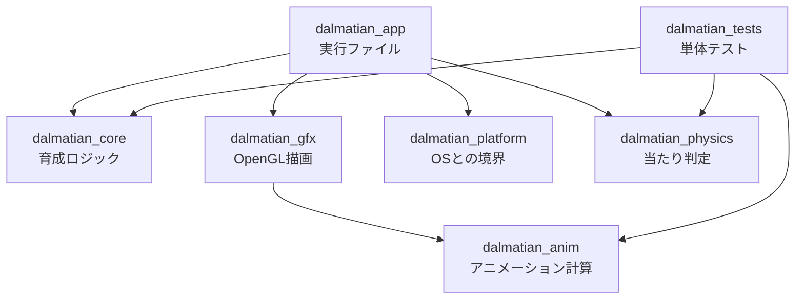

# ダルメシアン育成ゲーム

## 目的
ダルメシアンの育成3Dゲームを作成し、ポートフォリオとして公開する。

- **作品として**：本物の犬を育てるように、3D空間で暮らすダルメシアンの世話をすべてこなし、歩く・座る・食べる・尻尾を振るといった仕草を通して成長を見守るゲームを作る
- **技術として**：ゲームエンジンを使わず、C++20 と OpenGL でレンダラ・スケルタルアニメーション再生・育成ロジックを自作し、低レイヤの実装力を示す

## ゲーム概要
- **世話**：ごはん・散歩・なでる・しつけ・遊ぶ
- **成長**：子犬から成犬へ成長し、芸を覚えさせることができる
- **時間の進み方**：昼夜や空腹などは現実時間と同期して進み、成長や芸の習得は世話の積み重ねで進む（[ADR 0008](docs/adr/0008-time-progression-hybrid.md)）
- **終わり**：エンディングは設けず、ずっと育て続けられる

## 技術スタック

| 領域 | 選定 |
|---|---|
| 対象環境 | Windows デスクトップ（実行ファイル配布） |
| 言語 | C++20 / MSVC (Visual Studio 2022) |
| 描画API | OpenGL 4.6 Core |
| ゲームエンジン | 使用しない（レンダラ・アニメーション再生・育成ロジックは自作） |
| ビルド | CMake + Ninja、依存取得は FetchContent |
| 主な依存 | GLFW / glad / glm / cgltf / stb_image / Dear ImGui / miniaudio / nlohmann-json / Jolt Physics / Catch2 |
| 3Dアセット | Blender 経由で glTF 2.0 (.glb) に統一 |

選定理由は [docs/adr/](docs/adr/) の各ADRを参照。

## ファイル構成

```
Dalmatian-nurture
┣━ CMakeLists.txt
┣━ cmake/             CMake の補助スクリプト（依存取得・コンパイラ設定）
┣━ src/
┃   ┣━ core/            育成ロジック：欲求・世話・成長・芸・行動意図・セーブ（OpenGL非依存）
┃   ┣━ anim/            glTF読込・スケルトン・アニメーション計算（OpenGL非依存）
┃   ┣━ gfx/             OpenGL描画：シェーダ・スキンメッシュ・カメラ・昼夜の光
┃   ┣━ physics/         当たり判定：移動時のめり込み防止・視線の判定（Jolt を包む、OpenGL非依存）
┃   ┣━ platform/        OSとの境界：ウィンドウ・入力・システム時計・音声・保存先パス
┃   ┗━ app/             main・ゲームループ・シーン・デバッグUI
┣━ shaders/           GLSL
┣━ assets/
┃   ┣━ models/          .glb
┃   ┣━ textures/
┃   ┣━ audio/
┃   ┗━ source/          .blend などの編集元
┣━tests/
┃   ┣━ core/            core の単体テスト
┃   ┣━ anim/            anim の単体テスト
┃   ┗━ physics/         physics の単体テスト
┣━ third_party/glad/  glad の生成物
┗━ docs/adr/          決定事項の記録
```

各ファイルの一覧と構成のルールは [ADR 0009](docs/adr/0009-module-structure.md)、`physics` の追加は [ADR 0015](docs/adr/0015-physics-target.md) を参照。

### モジュールの依存関係



矢印は依存の向きを表し、逆向きの依存は禁止。`core`・`anim`・`physics` は OpenGL に依存しないため、描画なしで単体テストできる。

## ビルド

Visual Studio 2022（「C++ によるデスクトップ開発」ワークロード）が必要。
CMake と Ninja は Visual Studio に付属のものを使える。

「Developer PowerShell for VS 2022」などの MSVC の環境を読み込んだシェルで、次を実行する。
初回の構成時に依存ライブラリをダウンロードする。

```
cmake --preset debug
cmake --build --preset debug
ctest --preset debug
```

実行ファイルは `build/debug/src/app/dalmatian.exe`。リリースビルドは `debug` を `release` に置き換える。

## ドキュメント
- 決定事項: [docs/adr/](docs/adr/) — 1決定につき1ファイル（[運用ルール](docs/adr/0001-record-decisions-in-adr.md)）
- エージェント向けルール: [AGENT.md](AGENT.md)

## その他
